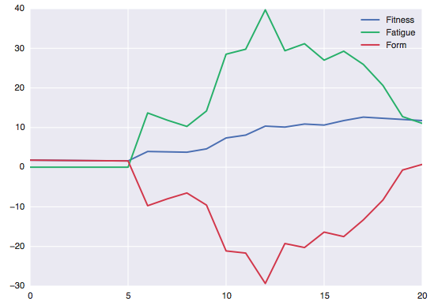

# Modeling Fitness using Wearables Data

[In Progress]

### Summary
This project is aimed at utilizing data from fitness wearables, including activity data and sleep & steps trackers to build a model tracking fitness, fatigue, and freshness on a given day for various activities, and ideally learn to predict performance on a given day.

The model currently exclusively uses heart rate monitoring as a measure for effort, reflecting my personal usage of a HR monitor whenever I exercise, and the fact I don't have a cycling power meter/wattbike/etc. Other measures of effort/stress may be added in the future.

The model assigns training loads to each activity based on a points system derived from the amount of time spent in each HR zone, with different zones accumulating points at different rates.

### Model Outputs
- Cardio Fitness/Fatigue/Form Values
    - Currently just average of all training loads across all activities from past 6 weeks for Fitness, 1 week for Form (based on Strava's decisions).
- Activity-Specific F/F/F Values    
    - Currently just average of all training loads across activities of that specific type from past 6 weeks for Fitness, 1 week for Form (based on Strava's decisions).
- Sleep Score
    - Model calculates mean sleep over last 4 weeks as a baseline, then calculates sleep score to be average of most recent 3 nights as a percentage of baseline.
- Steps Score [coming soon]
    - Calculated similar to sleep score, but utilizing a 2-day rather than 3-day average

Note: I will be evaluating whether an exponentially down-weighted approach yields more realistic results for any of the above. Preliminary analysis suggests this would make sense.


### Requirements
- Activity data must be in GPX form from a Garmin device (for now, at least)
- Sleep and steps data must be in .csv form, downloaded from Garmin Connect, and must contain at least 3 days' worth of values
    - More is better; recommend downloading 28-day


### Sample Usage from Terminal
[coming soon]


### Sample Usage from Python Command Line

All data (.gpx files, .csv containing sleep data) contained in a single folder:
```python
>>> from class_defs import Athlete
>>> Matt = Athlete(print_fitness_vals=True)
Sleep Score: 0
Cardio Fitness: 0
Cardio Fatigue: 0
Cycling Fitness: 0
Cycling Fatigue: 0
Running Fitness: 0
Running Fatigue: 0

>>> Matt.add_all_from_folder('~/Desktop/Activity_Data/',
                             print_fitness_vals=True)
Sleep Score: 104.9
Cardio Fitness: 7
Cardio Fatigue: 29
Cycling Fitness: 6
Cycling Fatigue: 29
Running Fitness: 0
Running Fatigue: 0

```


Add all activity data (but not sleep data) contained in a single folder:
```python
>>> from class_defs import Athlete
>>> Matt = Athlete(print_fitness_vals=True)
Sleep Score: 0
Cardio Fitness: 0
Cardio Fatigue: 0
Cycling Fitness: 0
Cycling Fatigue: 0
Running Fitness: 0
Running Fatigue: 0

>>> Matt.add_activities_from_folder('~/Desktop/Activity_Data/')
Sleep Score: 0
Cardio Fitness: 7
Cardio Fatigue: 29
Cycling Fitness: 6
Cycling Fatigue: 29
Running Fitness: 0
Running Fatigue: 0
```

### Sample Outputs

There is currently minor plotting functionality implemented in plotting.py, which should be scaled out over the near future and rolled into a web app. Here are a few examples of the current functionality, utilizing a few of my recent workouts. Notice that fitness/fatigue/form are low for the first few plotted days, then start to take off; this reflects some downtime taken after the holidays!

Plot of activity heart rate data and time in zones:


Plot of fitness, fatigue, and form:


